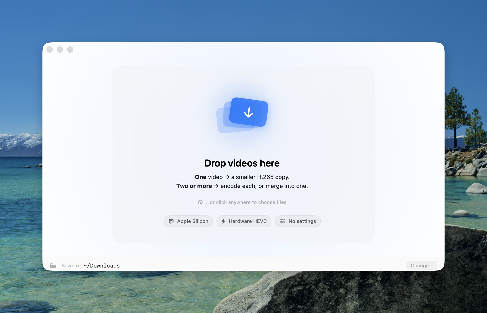

# ByeBye Bytes

**Drop a video. Get a smaller one.** A native macOS app that shrinks videos to H.265/MP4 using Apple Silicon's hardware media engine — with zero settings to tinker with.

[](https://www.apple.com/macos/)
[](https://swift.org)
[](LICENSE)
[](#)

<p align="center">
  
</p>

---

## What it does

Drag one or more videos onto the window. ByeBye Bytes inspects each file, picks the smartest encode plan, and writes a smaller H.265 MP4 to your output folder. That's it.

- **One video dropped** → a hardware-encoded HEVC copy.
- **Two or more dropped** → choose **Encode each** (batch) or **Merge into one** (concatenate, letterboxed if resolutions differ).
- **Already well-compressed** → the app quietly skips the encode and leaves your original untouched.

No settings menus, no bitrate sliders, no preset wizard. The app figures it out.

## Why

Most video compressors force you to make a dozen decisions before they'll touch a file. ByeBye Bytes takes the opposite approach: it knows what "visually lossless HEVC" looks like for each source and just produces it. If the source is already HEVC at a reasonable bitrate, it remuxes — no re-encode, no quality loss, instant.

## Features

- **Hardware HEVC** via `VideoToolbox` on Apple Silicon (M-series media engine).
- **Auto-quality** — inspects resolution, bit depth, HDR metadata, source bitrate, and derives an `EncodeRecipe` per file.
- **HDR passthrough** — preserves HDR10/HLG colour metadata end-to-end.
- **8-bit → HEVC Main, 10-bit → HEVC Main10** — picked automatically.
- **Fast-path remux** for sources already HEVC at a sensible bitrate (no re-encode, same quality, instant).
- **Merge mode** — combines N clips into one file. Uses `AVMutableComposition` fast-path when parameters match; falls back to a CoreImage-based normalise + letterbox pipeline when they don't.
- **Skip-if-no-gain** — if the encoded output isn't meaningfully smaller (< 2% saving), the app discards it and tells you the original is already well-compressed.
- **ADHD-friendly UI** — one focal point at a time, determinate progress bars only, no modals, respects `accessibilityReduceMotion`.
- **Liquid Glass** icon + UI surfaces on macOS 26 Tahoe (dark / tinted / clear variants auto-derived), with material fallbacks on macOS 14–15.
- **Keyboard** — `⌘O` opens the file picker from any state.

## Requirements

- macOS 14 Sonoma or later (Liquid Glass appearance variants require macOS 26 Tahoe)
- Apple Silicon (Intel also works — software HEVC encode, slower)

## Install

### Homebrew (recommended)

```bash
brew install --cask saiftheboss7/byebye-bytes/byebye-bytes
xattr -dr com.apple.quarantine "/Applications/ByeBye Bytes.app"
```

The second command clears macOS's quarantine attribute on the ad-hoc-signed app so Gatekeeper doesn't block it on first launch. You can skip this step by installing with `--no-quarantine` instead:

```bash
brew install --cask --no-quarantine saiftheboss7/byebye-bytes/byebye-bytes
```

Upgrades land the same way — `brew upgrade --cask byebye-bytes` (re-run the `xattr` command after each upgrade, or keep using `--no-quarantine`). Uninstall with `--zap` to also remove stored preferences:

```bash
brew uninstall --zap --cask byebye-bytes
```

Tap source: [saiftheboss7/homebrew-byebye-bytes](https://github.com/saiftheboss7/homebrew-byebye-bytes).

### Prebuilt (no Homebrew)

Download the latest `.app` from [Releases](../../releases), unzip, and drag **ByeBye Bytes.app** into `/Applications`. Because builds are ad-hoc signed, clear quarantine after copying:

```bash
xattr -dr com.apple.quarantine "/Applications/ByeBye Bytes.app"
```

Or right-click the app in Finder → **Open** once to allow it through Gatekeeper.

### Build from source

```bash
git clone https://github.com/saiftheboss7/ByeBye-Bytes.git
cd "ByeBye-Bytes"

# Produces build/ByeBye Bytes.app
./build-app.sh

# Install to /Applications
cp -R "build/ByeBye Bytes.app" /Applications/
```

Requires:
- Swift 5.9+ (ships with Xcode 15+ or the Command Line Tools)
- macOS 14+ as the build host

**Optional** — to enable full Tahoe Liquid Glass icon variants (compiled via `actool`), run the Xcode one-time setup:

```bash
sudo xcodebuild -license accept
sudo xcodebuild -runFirstLaunch
```

Then rebuild. Without this, the app ships a flat `.icns` (still looks great — just no auto-derived dark/tinted/clear variants).

### Xcode IDE

Open `Package.swift` in Xcode, or generate a full Xcode project:

```bash
brew install xcodegen
xcodegen generate
open ByeByeBytes.xcodeproj
```

The generated `.xcodeproj` is gitignored — `project.yml` is the source of truth.

## How it works

```
UI (SwiftUI)
  ↓ drop / click / ⌘O
JobQueue (actor-gated, max 2 concurrent encodes)
  ↓
MediaInspector  →  SourceProfile  (AVAsset → resolution, fps, codec,
                                    bit depth, HDR flags, audio info)
  ↓
SettingsResolver  →  EncodeRecipe  (pure function: profile → plan)
  ↓
Encoder
  ├─ RemuxEncoder       (source already HEVC → stream copy into MP4)
  ├─ SingleFileEncoder  (AVAssetReader → AVAssetWriter HEVC re-encode)
  └─ MergeEncoder
       ├─ fast path (AVMutableComposition, no re-encode)
       └─ normalise path (CoreImage letterbox + reader/writer concat)
  ↓
OutputRouter  →  ~/Downloads/<name>.hevc.mp4   (collision-safe: -1, -2, …)
```

### Auto-quality rules

| Source trait | Decision |
|---|---|
| Already HEVC at reasonable bitrate for its resolution | **Remux** — stream copy, no re-encode |
| H.264 source | HEVC encode, bitrate cap ≈ 55% of source |
| HEVC source outside the "sensible" bitrate band | HEVC encode, cap ≈ 85% of source |
| 10-bit or HDR source | HEVC **Main10**, HDR metadata preserved |
| Otherwise | HEVC **Main** |
| Quality target | `AVVideoQualityKey = 0.70` (visually-lossless zone) |
| GOP | `fps × 2` (2-second keyframe interval) |
| Container tag | `hvc1` (Apple/QuickTime-friendly) |
| Audio | AAC passthrough when possible; else AAC-LC 192 kbps, up to 5.1 channels |

### "Sensible HEVC bitrate" bands per resolution

| Tier | Range |
|---|---|
| ≤ 720p | 1.5 – 8 Mbps |
| ≤ 1080p | 3 – 15 Mbps |
| ≤ 1440p | 5 – 25 Mbps |
| 4K+ | 10 – 60 Mbps |

## Project layout

```
ByeBye Bytes/
├── Sources/ByeByeBytes/
│   ├── App/               # @main entry point
│   ├── Core/              # Types, MediaInspector, SettingsResolver, AppSettings
│   ├── Encoders/          # RemuxEncoder, SingleFileEncoder, MergeEncoder, EncoderCommon
│   ├── Queue/             # JobQueue, OutputRouter, ProgressReporter
│   └── UI/                # SwiftUI views + GlassStyle helpers
├── Resources/
│   ├── AppIcon.icns       # Flat icon (fallback)
│   └── Assets.xcassets/
│       └── AppIcon.icon/  # Liquid Glass layered source (Tahoe)
├── Scripts/
│   └── generate-icon.swift  # Regenerate icon artefacts
├── Package.swift          # SPM manifest
├── project.yml            # xcodegen source of truth
├── App.Info.plist         # Bundle Info.plist
├── ByeByeBytes.entitlements
└── build-app.sh           # SPM → signed .app bundle
```

## Development

```bash
# Fast iterative build
swift build
swift run ByeByeBytes

# Full .app bundle (signed, with icon)
./build-app.sh
open "build/ByeBye Bytes.app"

# Regenerate the app icon from source
swift Scripts/generate-icon.swift
```

Swift 5 language mode is in use — Swift 6 strict-concurrency warnings on `AVFoundation` types are non-blocking and tracked for a future migration pass.

## Contributing

PRs welcome. Please keep changes focused — one logical improvement per PR — and match the existing style (SwiftUI-idiomatic, minimal comments, no speculative abstractions).

## License

[MIT](LICENSE) © 2026 Saif Hassan
